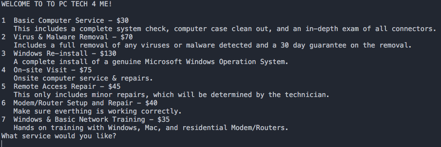

#Synopsis

This program is going to personally greet you by name when you first open it and inform you of the business that you are scheduling with. Then it will ask you what type of computer services you need by giving you options to pick, using numbers for you to select. Once you pick which service you want, it will calculate the total and include the sales tax. Then the program will allow the user to set up an appointment for the services previously selected. 

#Code Example
```
if (inFile.is_open())
	{
		while (!inFile.eof())
		{
			getline(inFile, number, '#');
			getline(inFile, services, '#');
			getline(inFile, stringCost, '#');
			getline(inFile, descr);
			cout << number << " " << services << " $" << stringCost << " " << descr << endl;
		}
		inFile.close();
	}
	else 
	{
		cout << "File failed to open" << endl;
	}
		cout << "What service would you like? ";
		cin >> inputString;
		input = atoi(inputString.c_str());
		
		while (input <= 7 && input > 0)
		{				
			int count = 0;
			inFile.open("Services.txt", ios::in);
			if (inFile.is_open())
			{		
				getline(inFile, number, '#');
				getline(inFile, services, '#');
				getline(inFile, stringCost, '#');
				getline(inFile, descr);
```				


#Motivation

This program will be beneficial to companies who utilize on-call and call-out services. The program will be user friendly, easy customizable and less likely to have technical errors versus competitors. It will be efficient and cost effective for business and less time consuming for the consumer.


#Tests

